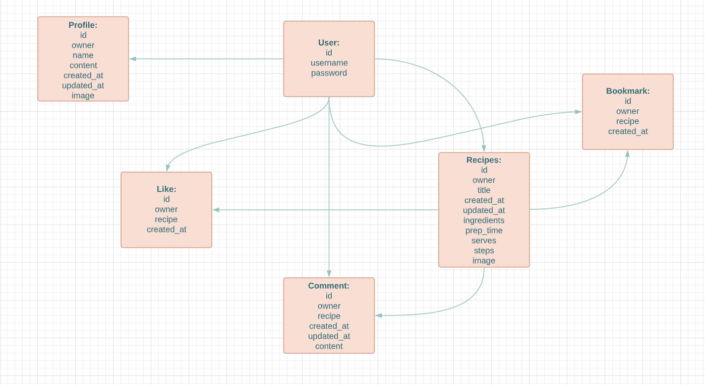

# Piehole 

Backend for the recipe sharing platform Piehole.

Deployed link can be found [here](https://piehole-drf-api.herokuapp.com/).

## Features

* Authentication
    - User can create account
    - Login/ Logout
* Recipes
    - User can list all recipes
    - User can view, create, edit or delete their own recipes
    - Recipes can be liked, commented on or bookmarked
* Likes
    - Logged in user can like/unlike posts
* Comments
    - Logged in user can view, create, edit or delete their own comments
* Bookmark 
    - Logged in user can bookmark a post
* Search
    - Users can search posts by author, title or ingredients

## Entity Relationship Diagram

## Technologies
 ### Languages, Frameworks
   - Python
   - Django Rest Framework

  ### Libraries, Websites & Programs Used
  * [Gitpod](https://gitpod.io/projects)
  * Paint
  * [Cloudinary](https://cloudinary.com/)
  * [Heroku](https://dashboard.heroku.com/apps)
  * [psycopg2](https://pypi.org/project/psycopg2/)
  * [AllAuth](https://django-allauth.readthedocs.io/en/latest/installation.html)
  * [Gunicorn](https://gunicorn.org/)
  * [JWT](https://jwt.io/)
  * [Pillow](https://pypi.org/project/Pillow/)
  

## Testing
### API Test Case
 Tests go through without problems
#### RecipeList view:
 - Tested if a user can list all the recipes
 - Tested if logged in user can create a recipe
 - Tested if logged out user can not create a recipe

 #### RecipeDetail view:

 - Tested if a user can retrieve a post with a valid id
 - Tested if a user can not retrieve a post with an invalid id
 - Tested if users can update the recipes they own
 - Tested if users can not update the recipes they don't own

### Manual testings:
Everything works fine

- Authentication
- Url paths
- CRUD recipes when logged in and logged out
- Like when logged in and logged out
- Comment when logged in and logged out
- Bookmark when logged in and logged out
- Error messages for not existing pages

### PEP8

I only got warnings about too long lines in Settings.py and env.py

### Bugs

There is no known bugs

## Deployment
### Heroku
1. Sign in or create account on [Heroku](https://id.heroku.com/login)
2. Create new app (add unique name and choose closest region)
3. Add resources (Heroku postgres)
4. Go to settings and Reveal Config Vars:
    * CLOUDINARY_URL,
    * DATABASE_URL,
    * SECRET_KEY
    * DISABLE_COLLECTSTATIC
5. In Deploy tab connect to Github and add your repository
6. Go to Manual Deployment choose main branch and press Deploy

 ### Forking
 * If you wish to fork the repository:
    - GitHub Search my username and repository
    - Select the repository
    - Click the fork icon in the top right
    - This creates a fork within your GitHub repositories
    - Edit the files as necessary to your remote repository

## Credits

- Code Institute's Moments walkthrough project
- http://opentechschool.github.io/django-101/en/first_steps/app.html
